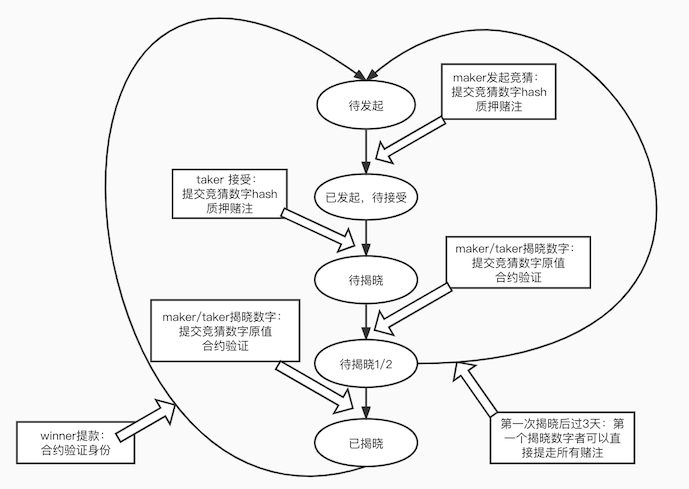

# 两人制猜数字游戏

### 玩法

---

- maker 提出 betting 请求，并给出自己数字的 hash，转账赌注
- taker 接受 betting，并给出自己数字的 hash，转账赌注
- maker、taker 分别揭晓自己的竞猜数字
- 合约计算揭晓结果，若两个数字差的绝对值为偶数则 maker 获胜，赢取全部奖金
- 否则 taker 获胜，赢取全部奖金
- winner 发起 withdraw，提走所有赌注
- 在一人揭晓数字后的 3 天内，如果另一人还补揭晓，则第一人可以直接提走所有奖金

| 在合约代码透明的情况下，保证先后猜的公平性

### TODO

---

- proposeTaker refound
